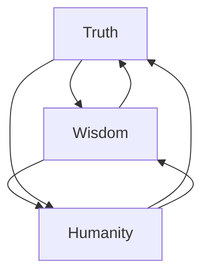

# Ethical Tetrahedron Diagram

```mermaid
graph TD
    Truth --> Wisdom
    Wisdom --> Humanity
    Humanity --> Truth
    Truth --> Humanity
    Wisdom --> Truth
    Humanity --> Wisdom
```

This diagram visualizes the geometric metaphor for the Triad principles.