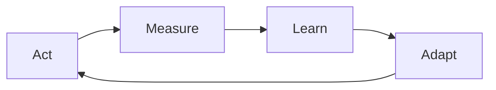

# Feedback Loop Diagram

```mermaid
flowchart LR
    A[Act] --> B[Measure]
    B --> C[Learn]
    C --> D[Adapt]
    D --> A
```

This diagram illustrates the core adaptive cycle of the Axiom Engine framework.
